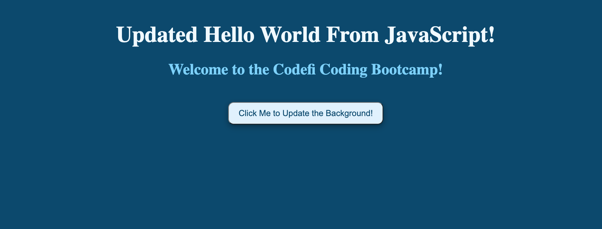

# Getting Started with JavaScript

## Preparation

### GOALS

By the end of this lesson, you will be able to:

1. **Grasp the primary purpose of JavaScript**
2. **Setup our tools and developer environment**
3. **Build our first JavaScript project**



---

### CONCEPTS

- **JavaScript:** _JavaScript_ is one of the core programming languages of the Web. Over 97% of websites use JavaScript to add interactivity and functionality to their page. JavaScript can be used to build interactive websites, mobile-apps, backend API’s, desktop applications, and even for machine learning!

- **DevTools:** _DevTools_ are the tools built directly into the browser which provide developers the ability to diagnose problems quickly, check network performance, write simple scripts, inspect the webpage, and more.

---

---

## Walkthrough

### STEP 1: JAVASCRIPT COURSE OVERVIEW

**Aim**: View the applications and projects we will be building

🔻

| _https://codefi-bootcamp-projects.netlify.com_ |

- [ ] Walkthrough Project 1
- [ ] Walkthrough Project 2
- [ ] Walkthrough Project 3

---

### STEP 2: SETTING UP OUR TOOLS

**Aim**: Play around with the Chrome DevTools

🔻

| _https://www.google.com_ |

- [ ] Open up the Chrome Developer Tools

  - Walkthrough the different tabs and give brief overview on their function

🔻

| _Dev Tools Elements Tab_ |

- [ ] Change Google Search button text

  - Use the element selector and click on the word "Goolge Search"
  - Change the input value to "Bing Search"
  - Change the input background-color to "red"

🔻

| _Dev Tools Console Tab_ |

- [ ] Create a variable that stores the value of an expression

  ```jsx
  const myVariable = 2 * 4;
  console.log(myVariable);
  ```

🔻

**Check**: Refresh the page and mix it up!

- Make the background a different color
- Change the navbar links
- Try to create a new variable and place it in on the page
- Be creative and explore

---

### STEP 3: JAVASCRIPT HELLO WORLD

**Aim**: Create a “Hello World” App using JavaScript

| _~Starter Code/index.html_ |

- [ ] Create HTML Boilerplate Code

  - Fill out the Title
  - Add Comments for Metadata, main content, and Javascript
  - Add a link to the stylesheet

  ```html
  <!DOCTYPE html>
  <html lang="en">
    <head>
      <!-- * META DATA * -->
      <meta charset="UTF-8" />
      <meta http-equiv="X-UA-Compatible" content="IE=edge" />
      <meta name="viewport" content="width=device-width, initial-scale=1.0" />

      <!-- Links -->
      <link rel="stylesheet" href="./styles.css" />

      <!-- Title -->
      <title>Hello World JavaScript</title>
    </head>

    <body>
      <!-- * MAIN CONTENT * -->

      <!-- * JAVASCRIPT * -->
    </body>
  </html>
  ```

🔻

- [ ] Add the Main HTML Content

  - Create a `<section><section>` element with a class of "container"
  - Create an `<h1></h1>` element inside the `<section><section>` tags
  - Create an `<h2><h2>` element with a class of "heading-two" below the `<h1></h1>`
  - Create a `<button></button>` with a class of "btn-primary" below the `<h2></h2>`

  ```html
  <!-- * MAIN CONTENT * -->
  <section class="container">
    <h1>Hello World!</h1>
    <h2 class="heading-two">Welcome to the Codefi Coding Bootcamp!</h2>

    <button class="btn-primary">Click Me to Update the Background!</button>
  </section>
  ```

  - Open up your file on "LiveServer"

🔻

| _Chrome DevTools Console Tab_ |

- [ ] Alter the Heading's Content & Color

  - Create a new variable `const myHeading` and set it equal to the first `<h1>` tag using `querySelector()`
  - Use the `.innerText` property on the `myHeading` variable to change the text content to "JavaScript Hello World"
  - Use the `.style.color` property selector to change the `myHeading` variable to "blue"

  ```jsx
  // Selects the first "h1" tag in the document
  const myHeading = document.querySelector("h1");

  // Changes the inner text content of the heading we selected
  myHeading.innerText = "JavaScript Hello World";

  // Changes the text color of the heading we selected
  myHeading.style.color = "blue";
  ```

🔻

- [ ] Move the JavaScript Code to the HTML File

  - Add `<script></script>` tags at the bottom of the `<body></body>` in the HTML file
  - Inside the script tag, create a variable that represents the `<h1></h1>` on the document by selecting the tag
  - Inside the script tag, create another variable that represents the `<h2></h2>` on the document by selecting it's class name
  - Change the `.innerText` of the variable representing the `<h1>` to say "JavaScript Hello World!"
  - Change the `.style.color` of the variable representing the `<h2>` to be the hex color code of "#134e4a"

```html
<script>
  // Selects the first <h1> element
  const headingOne = document.querySelector("h1");

  // Selects the element with a class name of "heading-two"
  const headingTwo = document.querySelector(".heading-two");

  // Changes the "headingOne" variable's text content
  headingOne.innerText = "Updated Hello World From JavaScript!";

  // Changes the "headingTwo" variable's text color
  headingTwo.style.color = "#134e4a";
</script>
```

🔻

- [ ] Change the Background on Button Click Event

  - As an attribute on the HTML `<button></button>` tag, create an `onclick="changeBackground()"` function call
  - Inside the script tag, create yet another variable that represents the `<body></body>` on the document by selecting the tag
  - Create the `changeBacgkround()` function at the bottom of the script file that selects the `bodyEl` variable and changes the `.style.backgroundColor` to the hex value "#0c4a6e"
  - Because the text is hardely visible, change the color of the `headingOne` variable to "#f0f9ff" and the `headingTwo` variable to "#7dd3fc" after the button is clicked

```html
<script>
  // Selects the first <h1> element
  const headingOne = document.querySelector("h1");

  // Selects the element with a class name of "heading-two"
  const headingTwo = document.querySelector(".heading-two");

  // Selects the body element
  const bodyEl = document.querySelector("body");

  // Changes the "headingOne" variable's text content
  headingOne.innerText = "Updated Hello World From JavaScript!";

  // Changes the "headingTwo" variable's text color
  headingTwo.style.color = "#134e4a";

  // Change the body's background color, and the text color on click
  function updateColors() {
    bodyEl.style.backgroundColor = "#0c4a6e";
    headingOne.style.color = "#f0f9ff";
    headingTwo.style.color = "#7dd3fc";
  }
</script>
```

🔻

- [ ] Move the JavaScript Code a Dedicated File

  - Create a new JavaScript file in the main folder titled `main.js`
  - Copy the code inside the script and paste it into the file
  - Add a `src` property on the `<script>` tag and link it to the file we just created.

```jsx
// Selects the first <h1> element
const headingOne = document.querySelector("h1");

// Selects the element with a class name of "heading-two"
const headingTwo = document.querySelector(".heading-two");

// Selects the body element
const bodyEl = document.querySelector("body");

// Changes the "headingOne" variable's text content
headingOne.innerText = "Updated Hello World From JavaScript!";

// Changes the "headingTwo" variable's text color
headingTwo.style.color = "#134e4a";

// Change the body's background color, and the text color on click
function updateColors() {
  bodyEl.style.backgroundColor = "#0c4a6e";
  headingOne.style.color = "#f0f9ff";
  headingTwo.style.color = "#7dd3fc";
}
```

🔻

**Check**: Ensure All the Code Still Works

- Try clicking the button and see if the background and text indeed do change
- Walk over the code one line at a time... do you understand how everything is working?

---

---

## Review

### ACCOMPLISHMENTS

Congratulations yet again! 🎊🎉

Feel proud that **you learned something new and valuable today**.

Learning to code is a journey, and you are taking the necessary steps to improve your skills and opportunities for the future.

_Good on you!_

Specifically, we learned how to:

- Better understand the role and function of JavaScript in Web Development
- How to run JavaScript code in the Dev Tools, HTML file, and as a dedicated JS file
- Change the background color of the body on click of a button

---

### RESOURCES

[Javascript Introduction for Beginners _(Video)_](https://www.youtube.com/watch?v=eXQom29T5I8)

[An Introduction to JavaScript _(Article)_](https://javascript.info/intro)

---

---
